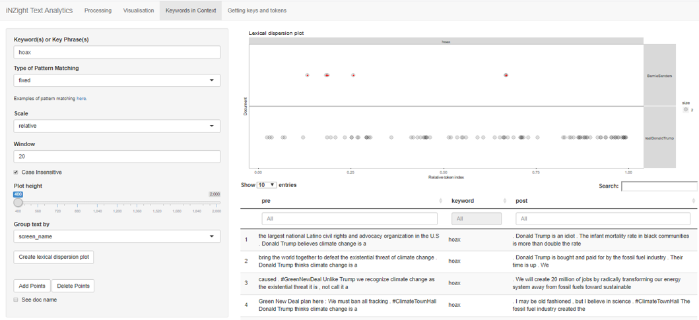

```{css, echo=FALSE}
    body .main-container {
      max-width: 1280px !important;
      width: 1280px !important;
    }
    body {
      max-width: 1280px !important;
    }
```

```{r, include = FALSE}
knitr::opts_chunk$set(
  collapse = TRUE,
  comment = "#>"
)
```

This vignette will walk you through the main features of the iNZight Text Analytics app. We will import data from Twitter and construct simple visualizations using data from Bernie Sanders’s and Donald Trump’s tweets. 

## Importing

Twitter data can be retrieved by accessing its Application Programming Interface (API). An API is a set of rules that allows software programs to communicate with each other (Kwartler, 2017). 


In my case, as I’m running the app on the R console, the R console will send a request to the Twitter API. The request consists of the URL endpoint, the necessary authorization, the desired action, and the parameters that give additional information on the request. 


If the request is understood and within the call rate limits, the API then interacts with a server to retrieve the requested information. This information can then be parsed then analyzed in the app. 

{#id .class width=20% height=20%}

Click on `***Create Twitter authorization token***` to show a tab where you can input your Twitter credentials (See the “Getting keys and tokens” tab for directions on how to obtain developer credentials.). Once you have inputted these, click on “Create token” to save your credentials for the rest of the session. Click on `***Create Twitter authorization token***` again to hide the tab. 

We can collect tweets from any number of users. Separate the usernames with a % symbol, as in the picture above. Let’s gather the last 4000 tweets from each user, then exclude the retweets. Click on “Gather tweets.” (Note that the data used for this analysis was collected on February 12, 2020, so your results may be different from mine.)

## Processing

There are three main components of text processing: noise removal, normalization, and tokenization (Silge & Robinson, 2017). Noise removal means cleaning up the text, e.g. removing HTML entities. Normalization puts all text on a level playing field, e.g., lemmatization.  Tokenization splits a chunk of text into smaller pieces called “tokens.” In this case, the tokens are words, but they can also be sentences or n-grams. 


The specific tasks performed in the processing step are outlined in the table below. The first three are done by default, while the rest are optional.  


| Task | Before | After |
|:------|:-----|:---------|
|  Removing HTML tags and entities  | `<p>`I had coffee `&amp;` toast for breakfast.`</p>` |  I had coffee & toast for breakfast.  |
|  Converting encoding  |  The coffee `wasn’t` strong enough. |   The coffee wasn’t strong enough.    |
|  Stripping punctuation  | Drats! The coffee spilled! |  Drats The coffee spilled  |
|   Expanding abbreviations and contractions   |  Mr. Darcy didn’t drink his coffee. |  Mister Darcy did not drink his coffee. |
|  Lemmatization  | Transforming words to do text mining applications is often needed. |  transform word to do text mine application be often need.  |
|  Removing stopwords  | Kopi luwak is made from coffee beans plucked from civets’ feces. |  Kopi luwak made coffee beans plucked civets’ feces.  |

For tweets, there are additional options to remove usernames and hashtags. 


For this analysis, let us opt to lemmatize the text and to remove stopwords using the default snowball lexicon. Now, click on “Process”. Click on the “Processed” tab in the main panel to view the data frame to be analyzed. 

## Sectioning (for file uploads and Project Gutenberg)

Project Gutenberg provides texts as a data frame with a line of text in each row. After this imported data undergoes processing, we end up with a data frame with one word per row, and each word is identified by its line ID, sentence ID, and word ID. If, in addition, we want to keep track of which chapter each book comes from, we can Section by “chapter” to set up another column in the processed data frame. 


Some caution must be taken because regular expressions are used to find where all the sections are. 

## Filtering 

Say, we want to analyze only the tweets mentioning the user `@foxandfriends`. Select “mentions_screen_name” as the column to apply filtering to. Type in “foxand” as the value to match (Note that the filtering is case-sensitive).


## Analysis
### Frequencies
#### Term Frequency 

Sometimes merely looking at frequent terms can be revealing. On occasion, some terms are expected to occur frequently within a text mining project. However, unusual words or phrases can yield a previously unknown relationship. 


Although not aesthetically interesting, a bar plot can convey amounts in a quick and easy‐to‐digest manner. Let us create a bar plot of the most frequent terms and see if anything surprising shows up.

##### Grouping vs Faceting 

Grouping allows us to perform an operation on groups defined by a variable. If we do not group on any variable, the bar plot will show the top five terms used in the entire body of collected tweets, whereas if we Group by “screen_name,” the plot will show the top five terms used by `@realDonaldTrump` and the top five terms used by `@BernieSanders`. We only see nine terms here because one of these terms is frequently used by both. 


Faceting partitions the plot into a matrix of panels, each showing a different subset of the data. 


Furthermore, if we tick “Scale Fixed”, the two panels will share the same axes. This way, we can easily contrast the words that both users use frequently.


##### Other forms of visualization 
Every analysis has a default visualization. Alternative visualizations are available in the drop-down list.


Another common visualization is a word cloud. In a word cloud, words are represented with varying font size. The larger a word in the word cloud the more frequent the word is in the text.


#### TF-IDF

The TF-IDF statistic reflects the importance of the information contained in a word. For instance, if we were analyzing the chapters of a textbook on text analytics, the word “text” would probably dominate in simple term-frequency counts. However, as the word “text” appears in all the chapters, this word does not provide much insight into what each specific chapter is about. To offset this, we define each chapter as a “document” then multiply the term frequency (TF) of the word “text” by its inverse document frequency (IDF). A word’s IDF is proportional to its rarity across documents (Kwartler, 2017). 


Mathematically, the TF-IDF is defined as follows. 
TF-IDF = TF*IDF, where
Term frequency (TF) = (number of times a word appears in a document / document length) Words may appear more often simply because documents are long, so we normalize the frequency by dividing by document length.


Inverse document frequency (IDF) = log (total number of documents / number of documents with the term in it) 
Here, we use “screen_name” as a grouping variable, so `@realDonaldTrump`’s tweets comprise one document, and `@BernieSander`’s another. 


Consider the word “much.” It has a large TF. However, as it appears in both documents, its IDF = log(2/2) = log(1) = 0. Therefore, it has a TF-IDF score of 0. 


As we only have two documents, here, the TF-IDF returns the most frequent terms used exclusively by each user. For instance, `@BernieSanders` never mentioned foxnews in any of the collected tweets. 


#### n-gram Frequency

We also can split the text into consecutive sequences of words, called n-grams. When n = 2, we are examining words that appear consecutively in the text (excluding stopwords). The co-occurrences of words can give us an idea of the relationships between them. 


“Radical left” has been changed to “radical leave” because of lemmatization. 

##### Subsetting

We could see whether there are other bigrams used by @BernieSanders that contain the word “trump.” Scroll down to the table below. Type in “Bernie” and “trump” in the “screen_name” and “n-gram” filters respectively, then press Enter. To view this data in the bar plot, click on the “Subset” button below the table. Click on “Restore” to restore the full data set. Note that if not restored, the subsetted data will be used for the rest of the analyses. 


#### Aggregated Term Count

A density plot can be used to compare the distribution of the lengths of the two users’ tweets. 

A large proportion of `@realDonaldTrump`’s tweets are 40 words or longer, whereas `@BernieSanders` has a more even distribution of long and short tweets. 

##### Additional Visualization Options

By default, the two density plots will be side by side. To arrange them one on top of another for easier comparison, click on “Additional visualization options” to change the plot settings. These options are available for all types of analysis. 


We can also view their longest tweets. 


To view the full text of `@realDonaldTrump`’s longest tweet, we go back to the “Processing”, to the “Imported” tab and search the table. 


### Text Summarization
#### Key Words with TextRank

First a graph is constructed with the words in the text as nodes. An edge is set up between two words if they co-occur within a window of five words (excluding stopwords), with the weight of an edge being proportional to the number of times this happens. The PageRank algorithm is then applied on top of the resulting graph to get the most representative keywords (Mihalcea & Tarau, 2004).

##### PageRank

To give a rough idea about PageRank, let us first normalize the edge weights so that the edge weight between word A and word B represents the probability of jumping from word A to word B, or from B to A.


A word is more “important” if we spend a larger fraction of time in its node while traversing this graph. The “importance” of a word W then depends on the “importance” of all other words linking to it, and on the probability of jumping into W, given that we are at a neighboring node (how often these words co-occur) (Roberts, 2016). 

#### Key Sections with LexRank

The Bound Aggregates are viewed as the “sentences.” The goal is to find the most representative “sentences” in the body of text. 

Let’s first filter so that we are looking only at the tweets of `@realDonaldTrump`. 


Here, we chose to aggregate on “id”, which will equate tweets with “sentences.” The LexRank algorithm will then return the most representative tweets of `@realDonaldTrump`.

Behind the scenes, each tweet is represented as an N-dimensional vector, where N is the number of unique terms in the entire body of `@realDonaldTrump` tweets. For each word in a tweet, the corresponding entry in the vector representation of the tweet is the TF-IDF of the word. To find the similarity or “distance” between two tweets, we calculate the cosine similarity between the corresponding vectors. We can view the tweets as nodes of a graph and the edges between two nodes (tweets) are based on their similarity. Again, the PageRank algorithm is applied on this resulting graph (Erkan & Radev, 2004). 


### Sentiment Analysis

One way to analyze the sentiment of a text is to consider the text as a combination of its individual words. To quantify the sentiment of a piece of text, we add together the sentiment content of the individual words. 


In this app, there are four available sentiment lexicons. Three are general purpose: AFINN (Nielsen, 2011), Bing (Hu & Liu, 2004), and NRC (Mohammad & Turney, 2013). The last, Loughran (Loughran & McDonald, 2011), is specific for use with financial documents. 


All these lexicons assign single words to a sentiment score or to an emotion. 


The AFINN lexicon assigns words to a numerical score between -5 and 5.


The Bing lexicon categorizes words into those with “positive” and “negative” sentiment.


The NRC lexicon associates words with eight basic emotions, including “anger”, “anticipation”, “disgust”, “fear”, “joy”, “sadness”, “surprise”, or “trust”, and two sentiments, “positive” and “negative”. Note that a word could have many labels, for instance, the word “abandon” has a “negative” sentiment and is associated with both “fear” and “sadness.”


The Loughran lexicon uses four classifications relevant in financial contexts, including "litigious", "uncertainty", "constraining", or "superfluous" and two sentiments, "positive" and “negative”.


So that we can also work with the Bing, NRC, and Loughran lexicons for analyses that need numeric sentiment lexicons, we assign a “positive” sentiment with a value of +1 and a “negative” sentiment with a value of -1. 

#### Term Sentiment
In the Page View visualization, words found in the sentiment lexicon are highlighted. For example, the plot below shows words among the collected tweets are associated with “anger” based on the NRC lexicon.


#### Moving Average Term Sentiment

The moving average term sentiment plot provides a visual inspection of the possible changes in sentiment trend through the course of a text.

Suppose we choose a lag length L for our calculation.  The first element of the moving average is obtained by taking the average sentiment of the first L words. Then we shift forward and take the average sentiment of the 2nd to the (L+1)th word, and so on. 

Let us choose a lag length of 740 words (about 20 tweets).  It seems that `@BernieSanders` has increasingly been using words with a positive sentiment in his recent tweets. 


The Moving Average Term sentiment can also be used to plot the emotional arc through a story. Below is the annotated time series plot for “The Ugly Duckling” by Hans Christian Andersen.


#### Aggregate Sentiment

We can visualize the mean sentiment over some aggregation. Aggregate on the variable “id” to calculate the mean sentiment of each tweet.  


Among `@realDonaldTrump`’s tweets with a positive overall sentiment, which are the most representative? 

##### Subsetting

Filter the desired tweets using the table under the visualization, then click “Subset” to use the filtered data for further analysis. 


Now, visualize “Key Sections” and aggregate on “id.” 


##### Problem with Dictionary-based Sentimetn Analysis

Notice that the tweet “Not good” is still in our subsetted data, which we expected to contain only tweets with positive overall sentiment. Our approach to sentiment analysis simply counted the occurrence of positive or negative words, based on a reference lexicon. This example highlights the main problem with this approach. The context of the word “good” was not considered. It was counted as positive, even though it was preceded by a negation. 

### Words in Context 
#### Word Tree

A word tree shows which words most often follow or precede a root word (Gesmann & de Castillo, 2011).


There are three types of word trees, namely, suffix, prefix, and double.  
Suffix – the root word is on the left and the words immediately following the root are on the right
Prefix – the root word is on the right
Double – the root word is in the center


It is possible to construct the word tree with only a subset of the data. In this example, we construct a word tree of @BernieSander’s tweets by specifying that we want to Group the data by “screen_name” and that we want to View the word tree for “BernieSanders.” At the moment, we cannot show several word trees side by side for direct comparisons.


If both these input boxes are left blank, the word tree will be constructed using the entire body of tweets. 


The display size of the words reflects its frequency in the text. Hovering the mouse over a word brings up the specific frequency. We can navigate the tree by clicking on any word. For instance, given that the current word is “i stand,” clicking on “i” will re-center the word tree on “i”, whereas if we click on a word word in a branch of the tree, such as “educators”, then the tree re-center on the longer phrase “i stand with the educators”


#### Lexical Dispersion Plot and Keywords in Context (KWIC) Table
Raw frequencies of words and n-grams can tell us how often a word or an n-gram occurs throughout the text. But when and where in the text do these appear? 


A lexical dispersion plot shows the location (how many words from the beginning) of a word/phrase. Each point represents an instance of the word/phrase and each row represents a document. The points are translucent, so parts of the document with a high concentration of the keyword/phrase will have a high density of overlapping points and appear dark on the plot. 

Let us check whether @realDonaldTrump’s use of the word “hoax” has changed in the past few weeks. We can compare the dispersion of multiple terms/phrases, by separating the keywords/phrases with commas.

Choose “fixed” as the type of pattern matching. There are three types of pattern matching available, namely, glob-style wildcard expressions, regular expressions, and fixed, exact matching. For glob-style pattern matching, ‘*’ is a wildcard that will match any number of characters (including none) and ‘?’ will match any single character. Visit https://quanteda.io/reference/kwic.html to view examples. 

An absolute scale shows the absolute token index position from 1 to number of tokens in the text, whereas a relative scale is normalized from 0 to 1 to show relative position. We will use the “relative” scale.

In the Window text box, we specify the number of words to the right and to the left of the keyword we would like to view in the KWIC table later. Choose a window of 20 so that we might be able to read the whole tweet. 

We use the Group text by dropdown to select the variable to be used in grouping our text (e.g. chapter, title, filename, user). If we do not specify any variable, the whole text will simply be lumped together into one big document called “Text.” Group by "screen_name".



It seems that `@realDonaldTrump` increasingly used “hoax” in recent tweets. `@BernieSanders` has also used the word “hoax” in his tweets. To see the context in which the latter has used the word “hoax,” brush (click and drag) over the points and click “Add Points” to show the KWIC results for these points. To remove the points, brush over them again and click on “Delete Points.” If you have several texts, tick the “See doc name” checkbox to add in a column showing the name of the source text.

One advantage of searching using the KWIC table instead of the table in the “Imported” tab (as we did to find the longest tweet) is the added flexibility of using regex and glob pattern matching for searches. 

## References
Erkan, G. and Radev, D.R. (2004). Lexrank: Graph-Based Lexical Centrality as Salience in Text Summarization. Journal of Artificial Intelligence Research, 22, 457-479. 
	
Gesmann, M. & de Castillo, D. (2011). Using the Google Visualisation API with R. The R Journal, 3(2):40-44. doi:10.32614/RJ-2011-017

Hu, M. & Liu, B. (2004). Mining and summarizing customer reviews. Proceedings of the ACM SIGKDD International Conference on Knowledge Discovery & Data Mining (KDD-2004), 168-177. doi: 10.1145/1014052.1014073 

Kwartler, T. (2017). Text mining in practice with R. Hoboken, NJ: John Wiley & Sons Ltd. 

Loughran, T. & McDonald, B. (2011). When Is a Liability Not a Liability? Textual Analysis, 	Dictionaries, and 10-Ks. The Journal of Finance, 66(1), 35-65. Retrieved from 	www.jstor.org/stable/29789771 

Mihalcea, R. and Tarau, P. (2004). TextRank: Bringing order into text. EMNLP, 4, 404-411.

Mohammad, S. & Turney, P. (2013). Crowdsourcing a word-emotion association lexicon. 	Computational Intelligence, 29(3), 436-465.

Nielsen, A. (2011). A new ANEW: Evaluation of a word list for sentiment analysis in 	microblogs. Proceedings of the ESWC 2011 Workshop on 'Making Sense of Microposts': 	Big things come in small packages, 93-98. Retrieved from 	http://arxiv.org/abs/1103.2903. 

Roberts, E. (2016). The Google PageRank Algorithm [Course notes]. Retrieved from 	https://web.stanford.edu/class/cs54n/handouts/24-GooglePageRankAlgorithm.pdf 

Silge, J. & Robinson, D. (2017). Text mining with R: A tidy approach. Newton, MA: O’Reilly 
	Media.
